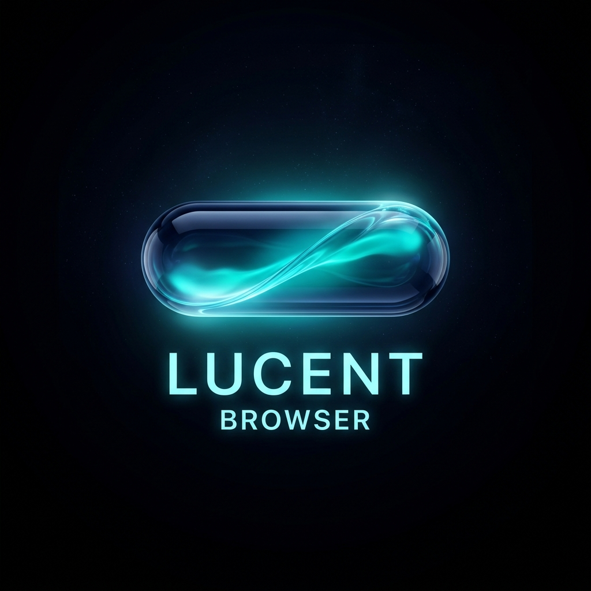

<div align="center">



# Lucent Browser (v1.0.0)

### *Ultra-minimalist, floating Liquid Glass Spotlight browser.*
**macOS Sequoia & visionOS aesthetics • Lightning-fast floating search and full-featured web browser in one.**

[](https://github.com/BBencht/Lucent-Browser/releases)
[](https://github.com/BBencht/Lucent-Browser)
[](LICENSE)
[](https://electronjs.org)

</div>

---

## 📥 Download Ready-to-Run App

Pre-built, standalone application packages for macOS, Windows, and Linux are available directly on the **[Releases Page](https://github.com/BBencht/Lucent-Browser/releases)**:

| Operating System | Platform | Package Format | Download |
| :--- | :--- | :--- | :--- |
| 🍏 **macOS** | Apple Silicon (M1-M4) & Intel | `.dmg` installer / `.zip` | [**Download for macOS**](https://github.com/BBencht/Lucent-Browser/releases) |
| 🪟 **Windows** | Windows 10 & 11 (64-bit) | `.exe` installer / `.zip` portable | [**Download for Windows**](https://github.com/BBencht/Lucent-Browser/releases) |
| 🐧 **Linux** | Ubuntu, Fedora, Arch, etc. | `.AppImage` standalone / `.tar.gz` | [**Download for Linux**](https://github.com/BBencht/Lucent-Browser/releases) |

> **Quick tip:** On macOS, download the `.dmg`, drag Lucent to your Applications folder, and launch! Press **`Alt + Space`** anytime to summon.
>
> **First-time launch on macOS (Gatekeeper bypass):**  
> As an independent open-source project not signed with a paid Apple Developer ID, macOS may flag downloaded apps with a *"damaged / unverified"* warning. To open it in one second, drag it to Applications and run this in Terminal:  
> ```bash
> xattr -cr "/Applications/Lucent Browser.app"
> ```  
> *(Or open **System Settings $\rightarrow$ Privacy & Security** and click **"Open Anyway"**).*

---

## 🌟 What is Lucent Browser?

**Lucent Browser** is a next-generation, distraction-free desktop web browser that merges the instantaneous responsiveness of macOS Spotlight with the state-of-the-art *Liquid Glass* design language of visionOS and macOS Sequoia.

With a single customizable global keystroke (**`Alt + Space`** or **`⌥ + Space`**), Lucent floats into view from the center of your display as a sleek, translucent glass capsule. Type a query or URL, and the capsule smoothly expands into a high-performance floating glass browser — or seamlessly glides into a dedicated native macOS Fullscreen Space. When you are done, close it with a tap and watch it pull up, contract into a glowing liquid orb, and dissolve gracefully back into your desktop.

---

## ✨ Key Features

- 🫧 **Authentic Liquid Glass UI (visionOS & macOS Sequoia):**  
  Engineered with multi-layered `backdrop-filter` blur, chromatic dispersion, specular edge highlights, and deep glassmorphic refractions.
- 🪄 **Fluid Morphing Animations & Physics:**  
  Lucent does not simply pop onto your screen. It emerges as a frosted liquid glass circle, stretches horizontally into the 740px Spotlight capsule with spring physics, and unrolls into the browser. On close, it reverses into the capsule and dissolves effortlessly.
- 🖥️ **True Native macOS Fullscreen (Dedicated Space):**  
  Full support for native macOS Spaces (`⌃⌘F` or `F11`). The macOS menu bar and Dock slide away for an immersive, distraction-free canvas. Exiting fullscreen returns instantly to the compact floating glass window with rounded corners.
- 🔍 **Spotlight Omnibox with Live Suggestions:**  
  Instant Google search autocompletion, fuzzy history search, and one-click search engine switching across **Google, DuckDuckGo, Bing, Brave, and Ecosia**.
- 📑 **Multi-Tab Architecture & Isolated Incognito Partitions:**  
  Seamless tab management with keyboard shortcuts (`⌘T`, `⌘W`, `⌘1-9`). Incognito tabs run in isolated memory partitions that automatically purge all cache, storage, and cookies upon closure.
- 🛡️ **Stealth Security & Anti-Detection Engine:**  
  - Automatic filtering of third-party telemetry, ad trackers, and analytic beacons.
  - Contextual User-Agent identity masking: automatically switches to a modern Firefox fingerprint on Google login domains, completely bypassing Google's embedded Chromium webview blocks.
- 👆 **Precision Trackpad Gesture Navigation:**  
  Natural two-finger horizontal swipe gestures for instantaneous page back and forward navigation in browsing history.
- ⚙️ **Customizable Shortcuts & Visual Glass Themes:**  
  Configure your global summon hotkey, in-app navigation shortcuts, and glass themes (Apple Liquid, Aurora Cyan, Dark Glass, Obsidian) directly through the built-in visual settings panel.

---

## ⌨️ Keyboard Shortcuts Reference

| Shortcut | Action |
| :--- | :--- |
| **`Alt + Space`** *(or `⌥ + Space`)* | **Summon / Dismiss Lucent from anywhere (Global Hotkey)** |
| **`⌘ + T`** / `Ctrl + T` | Open New Tab (via Spotlight Search) |
| **`⌘ + Shift + N`** / `Ctrl + Shift + N` | Open New Private / Incognito Tab |
| **`⌘ + W`** / `Ctrl + W` | Close Active Tab |
| **`⌘ + Shift + T`** / `Ctrl + Shift + T` | Reopen Recently Closed Tab |
| **`⌘ + L`** / `Ctrl + L` | Focus Search / URL Omnibox |
| **`⌘ + 1` ... `⌘ + 9`** | Switch directly to Tab 1 through 9 |
| **`⌃ + ⌘ + F`** or **`F11`** | Toggle True Native Fullscreen Mode |
| **`⌘ + [`** / **`⌘ + ]`** | Navigate Back / Forward in History |
| **`⌘ + R`** | Reload Current Web Page |
| **`Escape`** | Exit Fullscreen / Dismiss Search Results / Close Settings |

---

## 🚀 Installation & Quick Start

### Prerequisites
- [Node.js](https://nodejs.org/) (version 18 or higher recommended)
- `npm` or `yarn`

### 1. Clone the repository
```bash
git clone https://github.com/BBencht/Lucent-Browser.git
cd Lucent-Browser
```

### 2. Install dependencies
```bash
npm install
```

### 3. Launch Lucent Browser
```bash
npm start
```

Press **`Alt + Space`** (or **`⌥ + Space`**) to toggle the browser!

---

## 📦 Building Standalone Binaries

Lucent is pre-configured with `electron-builder` to package standalone executable applications:

- **macOS (.app / .zip):**
  ```bash
  npm run dist:mac
  ```
- **Windows (.zip):**
  ```bash
  npm run dist:win
  ```
- **Linux (AppImage / .tar.gz):**
  ```bash
  npm run dist:linux
  ```

Packaged distribution bundles will be generated in the `dist/` directory.

---

## 🛠️ Architecture & Under the Hood

- **Core Engine:** [Electron](https://www.electronjs.org/) + Chromium
- **User Interface:** Vanilla JavaScript (ES6+), GPU-accelerated CSS transforms, CSS Houdini backdrop filtering
- **Content Isolation:** Electron `<webview>` tags running in partitioned sessions with strict `contextIsolation` and disabled node integration for bulletproof security
- **Cross-Platform:** macOS (Apple Silicon M-Series & Intel x64), Windows 10/11, Linux

---

## 📄 License

This project is licensed under the **MIT License**. See the [LICENSE](LICENSE) file for complete details.

---

<div align="center">
  <sub>Crafted with passion by <b>Bence Bodori</b> • 2026</sub>
</div>
