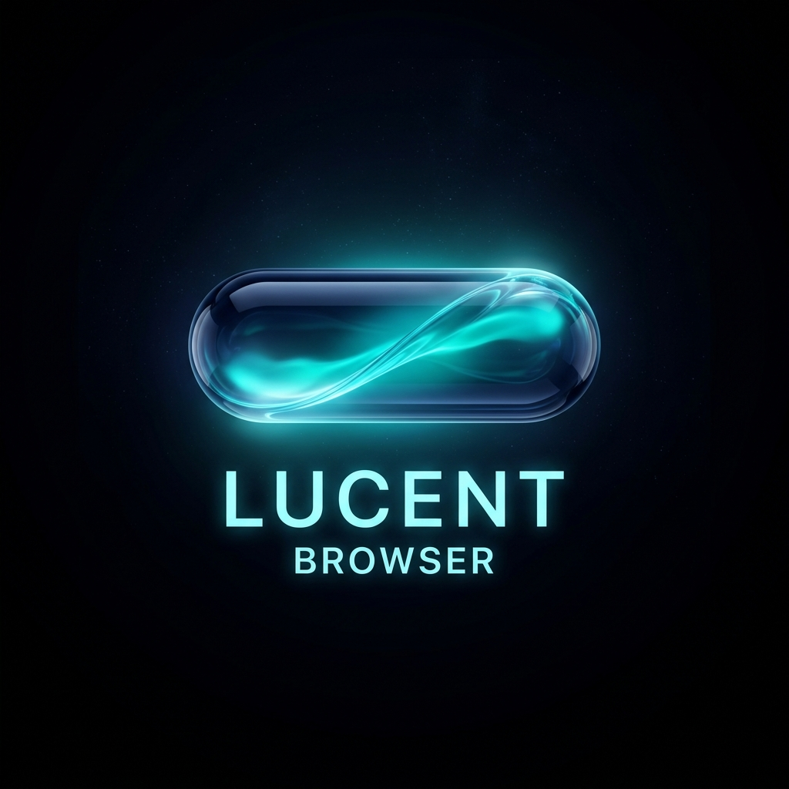
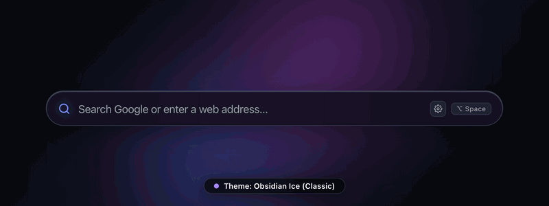
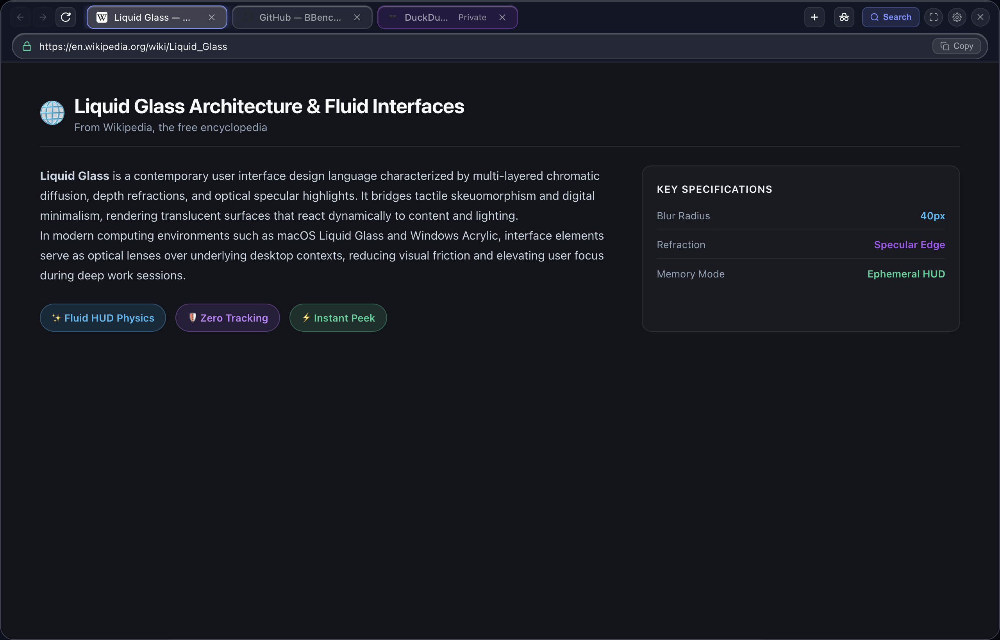
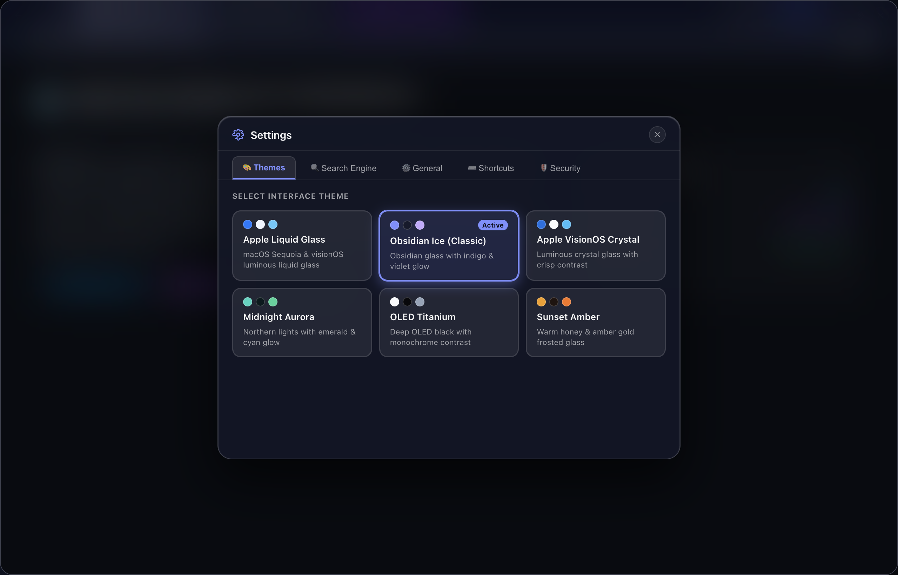

<div align="center">



# Lucent Browser (v1.2.0)

### *Ultra-minimalist, floating Liquid Glass HUD browser with Instant Smart Answers for Windows, macOS & Linux.*
**Universal floating search capsule, zero-config AI quick answers, and full-featured desktop web browser in one sleek translucent interface.**

[](https://github.com/BBencht/Lucent-Browser/releases)
[](https://github.com/BBencht/Lucent-Browser)
[](LICENSE)
[](https://electronjs.org)

<br/>



</div>

---

## 🌟 What is Lucent Browser?

**Lucent Browser** is a next-generation, distraction-free desktop web browser designed from the ground up for **Windows**, **macOS**, and **Linux**. It reimagines everyday web browsing by merging the instantaneous convenience of a floating command capsule with an ultra-modern translucent Liquid Glass interface.

With a single global keystroke (**`Alt + Space`** on Windows/Linux or **`⌥ + Space`** on macOS), Lucent floats into view from the center of your screen as a sleek glass capsule. Type a query or web address, and the capsule smoothly expands into a high-performance floating glass browser — or seamlessly glides into full-screen mode for immersive deep work. When you're done, tap `Escape` or dismiss it, and it pulls up, contracts into a glowing liquid orb, and dissolves gracefully back into your desktop.

### 💭 Stop opening a cluttered browser just to check one quick thing.

We’ve all been there: You’re studying, writing an email, watching a movie, or working on something important. You just need to check *one quick thing*—a recipe, an address, a quick translation, or an answer to a question.

You open your regular browser, and chaos greets you: **dozens of open tabs staring back at you**, unread notifications, shopping carts, and video feeds screaming for attention. Twenty minutes later, you’re trapped down an internet rabbit hole and completely forgot what you were doing.

**Lucent is the antidote.**

It’s not a giant window you get lost in—it’s an ethereal, floating lens over your desktop:

* ⚡ **A Reflex, Not a Chore:** Press **`Alt + Space`** (or **`⌥ + Space`** on Mac). A luminous, frosted glass capsule glides to the center of your screen. Ask your question, get your answer, and tap **`Esc`**.
* 🫧 **Appears When Needed, Vanishes When Done:** The second you’re finished, Lucent smoothly contracts into a glowing orb and evaporates back into your desktop. No messy leftover windows. No taskbar clutter. Clean desk, clean mind.
* 🖥️ **Need More Space? Go Fullscreen Anytime:** Found an article you actually want to read, or a video you want to watch? Tap **`F11`** (or **`⌃⌘F`** on Mac), and Lucent effortlessly blooms into an ultra-clean, full-featured fullscreen browser with multi-tabs and private browsing—free of toolbars and visual noise.
* ✨ **Pure Content, Zero Distraction:** No clunky bookmarks bar, no blinking extension badges, no clutter. Just pure Liquid Glass aesthetics wrapped around what you actually want to see.

> **Need a 2-second answer?** Summon it and dismiss it.  
> **Want deep, focused reading?** Expand to fullscreen and browse without distractions.  
> **Keep your traditional browser for all-day tab chaos—use Lucent for everything else.**

<br/>

<div align="center">
  
  <p><em>Floating Liquid Glass browser mode with multi-tabs, isolated private browsing, and borderless canvas.</em></p>
</div>

---

## ⚡ Flagship Feature: Instant Smart Answers & AI Knowledge Hub

> **Why open slow search result pages or juggle cluttered tabs just to answer a simple question?**  
> Lucent Browser's floating Spotlight capsule (`Alt + Space`) is equipped with a built-in, **zero-configuration Smart Answer engine** that computes math, converts currencies and units, and delivers real-time encyclopedia knowledge summaries **as you type**, directly inside the HUD.

### 🌟 How It Works — 100% Zero-Config, Out of the Box:
* 🧮 **Instant Local Calculator (0ms Offline Engine):**  
  Type any arithmetic expression, percentage, square root, or exponent (e.g. `150 * 4 + 20`, `15% of 850`, `sqrt(144)`, `2^10`). Lucent calculates the exact result instantaneously with zero network lag and displays it in prominent typography.
* ⚖️ **Real-Time Unit & Currency Conversions:**  
  Type natural conversions (e.g. `100 cm in inch`, `50 kg in lbs`, `100 eur to huf`). Powered by real-time smart suggestions, the accurate converted value appears immediately above your search suggestions.
* ✦ **Instant AI & World Knowledge Overviews:**  
  Query people, places, historical figures, biology, geography, or science concepts (e.g. `Petőfi Sándor`, `Fotoszintézis`, `Albert Einstein`, `Quantum computing`, `Budapest`). Lucent fetches and formats concise summaries, entity thumbnails, and subtitles in real time (supporting Hungarian and English queries) with a 1-click **Source (Forrás)** link.
* 📋 **1-Click Copy with Liquid Glass Feedback:**  
  Click the **"Másolás" (Copy)** button on any answer card to copy the clean result or summary directly to your clipboard, confirmed with a luminous glass toast notification.
* 🛡️ **Zero Setup, Pure Privacy:**  
  **No API keys, no Google Cloud setup, no account creation, and no subscription.** It works immediately for every user without configuration.
* 🎛️ **Full User Control:**  
  Prefer raw web results only? You can toggle Instant Smart Answers ON or OFF at any time in **Settings** (`⌘,` or gear icon $\rightarrow$ **General** $\rightarrow$ `Instant Smart Answers`).

---

## ✨ Key Features

- **Instant Smart Answers & AI Knowledge Engine (Flagship):**  
  Zero-latency calculator, real-time currency/unit conversions, and instant Wikipedia knowledge summaries with thumbnails and copy actions right in the floating capsule.
- **Modern Liquid Glass & Acrylic Aesthetics:**  
  Engineered with multi-layered `backdrop-filter` blur, chromatic diffusion, specular edge highlights, and deep glassmorphic refractions that feel right at home on modern desktop interfaces (Windows Acrylic & Mica, macOS Liquid Glass, and Linux desktop environments).
- **Fluid Morphing Physics:**  
  Lucent does not simply pop onto your screen. It emerges as a glowing frosted glass circle, stretches horizontally into the floating search capsule with spring physics, and unrolls into the browser workspace.
- **Floating & Fullscreen Modes:**  
  Toggle between a focused floating glass window and an immersive distraction-free fullscreen canvas with a single key (`F11` on Windows/Linux or `⌃⌘F` on macOS).
- **Universal Search Omnibox with Live Suggestions:**  
  Instant search autocompletion, fuzzy browsing history search, and one-click search engine switching across **Google, DuckDuckGo, Bing, Brave, and Ecosia**.
- **Multi-Tab Architecture & Isolated Incognito Partitions:**  
  Seamless tab management with standard keyboard shortcuts (`Ctrl+T` / `⌘T`, `Ctrl+W` / `⌘W`, `Ctrl+1-9` / `⌘1-9`). Private tabs run in isolated memory partitions that automatically purge all cache, storage, and cookies upon closure.
- **Stealth Security & Anti-Detection Engine:**  
  Automatic filtering of third-party telemetry, ad trackers, and analytic beacons, paired with contextual User-Agent masking to bypass embedded Chromium webview blocks.
- **Precision Touchpad & Gesture Navigation:**  
  Natural two-finger horizontal swipe navigation on Windows precision touchpads and Mac trackpads for fluid back and forward history navigation.
- **Customizable Shortcuts & Glass Themes:**  
  Configure your global summon hotkey, in-app navigation shortcuts, and choose between 6 glass themes (Obsidian Ice, Apple Liquid Glass, Apple VisionOS Crystal, Midnight Aurora, Sunset Amber, OLED Titanium) through the built-in visual settings panel.

<br/>

<div align="center">
  
  <p><em>Integrated settings panel: instant theme switching, search engine selection, and shortcut personalization.</em></p>
</div>

---

## 📥 Download & Install

Pre-built, standalone application packages for **Windows**, **macOS**, and **Linux** are available directly on the **[Releases Page](https://github.com/BBencht/Lucent-Browser/releases)**:

| Platform | Architecture | Package Format | Download |
| :--- | :--- | :--- | :--- |
| **Windows** | 64-bit (Windows 10+) | Setup Installer | [**Installer (.exe)**](https://github.com/BBencht/Lucent-Browser/releases/download/v1.2.0/Lucent-Browser-Setup-1.2.0.exe) |
| **Windows** | 64-bit (Windows 10+) | Portable Archive | [**Portable (.zip)**](https://github.com/BBencht/Lucent-Browser/releases/download/v1.2.0/Lucent-Browser-1.2.0-win.zip) |
| **macOS** | Apple Silicon | Disk Image | [**Apple Silicon (.dmg)**](https://github.com/BBencht/Lucent-Browser/releases/download/v1.2.0/Lucent-Browser-1.2.0-arm64.dmg) |
| **macOS** | Intel | Disk Image | [**Intel (.dmg)**](https://github.com/BBencht/Lucent-Browser/releases/download/v1.2.0/Lucent-Browser-1.2.0.dmg) |
| **Linux** | x86_64 | Standalone Package | [**AppImage (.AppImage)**](https://github.com/BBencht/Lucent-Browser/releases/download/v1.2.0/Lucent-Browser-1.2.0.AppImage) |
| **Linux** | x86_64 | Compressed Tarball | [**Tarball (.tar.gz)**](https://github.com/BBencht/Lucent-Browser/releases/download/v1.2.0/lucent-browser-1.2.0.tar.gz) |

> **Tip for macOS users:** You can also install and launch directly from Terminal with:  
> `curl -fsSL https://raw.githubusercontent.com/BBencht/Lucent-Browser/main/install.sh | bash`

---

## 🛡️ First-Time Launch & Security Guide

Because Lucent Browser is an independent open-source project without expensive corporate code-signing certificates, your operating system may display a standard security notice upon first launch. Here is how to open it in seconds:

### Windows (SmartScreen)
1. When opening the installer or `.exe`, Windows Defender SmartScreen may display a protection dialog.
2. Click **"More info"** under the warning text.
3. Click the **"Run anyway"** button.
4. The application will start immediately.

### macOS (Gatekeeper)
Gatekeeper flags unsigned downloaded applications by default. Choose whichever option is easiest:
* **Terminal (Fastest — 2 seconds):** After dragging `Lucent Browser.app` to `/Applications`, run:
  ```bash
  xattr -cr "/Applications/Lucent Browser.app"
  ```
* **System Settings:** Double-click the app $\rightarrow$ click **Cancel** on the alert $\rightarrow$ open **System Settings** $\rightarrow$ **Privacy & Security** $\rightarrow$ scroll to **Security** $\rightarrow$ click **"Open Anyway"**.
* **Finder Right-Click:** Right-click (or `Control`-click) on **`Lucent Browser.app`** in your Applications folder $\rightarrow$ choose **Open** from the menu $\rightarrow$ click **Open** on the prompt.

### Linux (.AppImage)
1. Mark the downloaded `.AppImage` file as executable:
   ```bash
   chmod +x Lucent-Browser-*.AppImage
   ./Lucent-Browser-*.AppImage
   ```
2. Or right-click the `.AppImage` $\rightarrow$ **Properties** $\rightarrow$ **Permissions** $\rightarrow$ check **"Allow executing file as program"**.

---

## ⌨️ Keyboard Shortcuts Reference

| Windows / Linux | macOS | Action |
| :--- | :--- | :--- |
| **`Alt + Space`** | **`⌥ + Space`** | **Summon / Dismiss Lucent from anywhere (Global Hotkey)** |
| **`Ctrl + T`** | **`⌘ + T`** | Open New Tab (via Search Capsule) |
| **`Ctrl + Shift + N`** | **`⌘ + Shift + N`** | Open New Private / Incognito Tab |
| **`Ctrl + W`** | **`⌘ + W`** | Close Active Tab |
| **`Ctrl + Shift + T`** | **`⌘ + Shift + T`** | Reopen Recently Closed Tab |
| **`Ctrl + L`** | **`⌘ + L`** | Focus Search / URL Address Bar |
| **`Ctrl + 1` ... `Ctrl + 9`** | **`⌘ + 1` ... `⌘ + 9`** | Switch directly to Tab 1 through 9 |
| **`F11`** | **`⌃ + ⌘ + F`** | Toggle Fullscreen Mode |
| **`Alt + Left`** / **`Alt + Right`** | **`⌘ + [`** / **`⌘ + ]`** | Navigate Back / Forward in History |
| **`Ctrl + R`** or **`F5`** | **`⌘ + R`** | Reload Current Web Page |
| **`Escape`** | **`Escape`** | Dismiss Search Results / Close Settings / Exit Fullscreen |

---

## 🆕 What's New in v1.2.0

- 🚀 **Flagship Instant Smart Answers Engine:** Real-time calculator, unit & currency conversion, and AI encyclopedia knowledge summaries directly inside the floating Spotlight search bar.
- 🧮 **Instant Local Math Evaluator:** 0ms instant arithmetic, percentages (`15% of 850`), powers (`2^10`), and square roots offline with zero network latency.
- ✦ **Live Knowledge Cards:** Automatic entity detection for historical figures, scientific concepts, biology, geography, and definitions (supporting Hungarian & English) with rich thumbnails, extracts, and direct source links.
- 📋 **One-Click Clipboard Action:** Copy answers and formulas with a single tap, accompanied by Liquid Glass toast confirmation.
- ⚙️ **User Preference Toggle:** New toggle in `Settings` -> `General` to easily turn Instant Smart Answers on/off.
- 🫧 **Dynamic Glass Resizing:** Window spring physics dynamically scale Spotlight height to fit instant answers without visual clipping.

---

## 🆕 What's New in v1.1.1

- 🎯 **Floating Capsule Settings Positioning & Alignment Fix:** Fixed an issue where opening Settings from the capsule search bar pushed the settings panel down to the bottom half of the screen. When opened from Search mode, the capsule smoothly expands into a dedicated, draggable, beautifully aligned Settings window with full visibility of all theme cards, engine options, and shortcuts without vertical displacement.
- 🛡️ **Frosted Glass Backing & Readability:** High-opacity frosted acrylic backing across all themes ensures zero background bleed-through from desktop windows or wallpaper.
- 🎨 **Universal Glass Themes:** High-contrast light and dark themes with crisp card borders, dark text, and crystal glass accents.
- 🌐 **Full English UI Localization:** Search bar, settings dialogs, shortcut configurator, navigation tooltips, contextual history popups, and notification toasts localized to English.

---

## 🚀 Development & Build from Source

### Prerequisites
- [Node.js](https://nodejs.org/) (version 18 or higher recommended)
- `npm` or `yarn`

### 1. Clone the repository
```bash
git clone https://github.com/BBencht/Lucent-Browser.git
cd Lucent-Browser
```

### 2. Install dependencies
```bash
npm install
```

### 3. Launch Lucent Browser
```bash
npm start
```

Press **`Alt + Space`** (or **`⌥ + Space`**) to toggle the browser!

---

## 📦 Building Standalone Binaries

Lucent is pre-configured with `electron-builder` to package standalone executable applications for all major desktop platforms:

- **Windows (.exe installer & .zip portable):**
  ```bash
  npm run dist:win
  ```
- **macOS (.dmg installer & .zip):**
  ```bash
  npm run dist:mac
  ```
- **Linux (.AppImage & .tar.gz):**
  ```bash
  npm run dist:linux
  ```

Packaged distribution bundles will be generated in the `dist/` directory.

---

## 🛠️ Architecture & Under the Hood

- **Core Engine:** [Electron](https://www.electronjs.org/) + Chromium
- **User Interface:** Vanilla JavaScript (ES6+), GPU-accelerated CSS transforms, CSS backdrop filtering
- **Content Isolation:** Electron `<webview>` tags running in partitioned sessions with strict `contextIsolation` and disabled node integration for bulletproof security
- **Cross-Platform:** Windows (64-bit), macOS (Apple Silicon & Intel), Linux (all major distributions)

---

## 📄 License

This project is licensed under the **MIT License**. See the [LICENSE](LICENSE) file for complete details.

---

<div align="center">
  <sub>Crafted with passion by <b>Bence Bodori</b> • 2026</sub>
</div>
